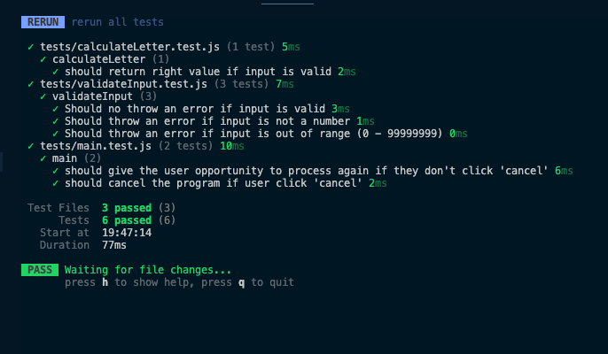

# JavaScript Kata - DNI

Go to [website](https://danielmuntyanu.github.io/JS-kata-DNI/) to see the result.

### Exercise task:
`Crear un programa que calcule la letra del DNI (Documento nacional de identidad).`

### Stack:
- JavaScript
- Vite
- Vitest
- TailwindCSS

 

# Unit Tests
